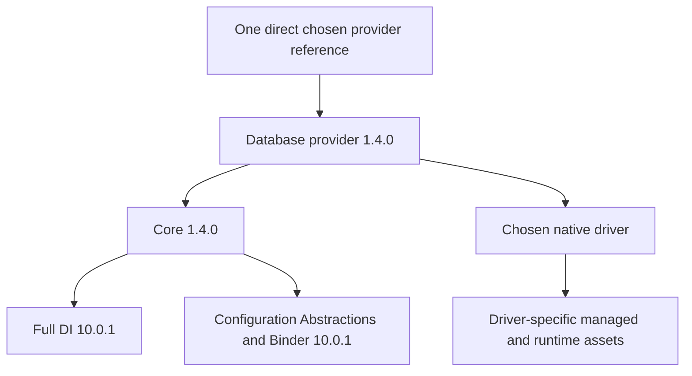

# Implementation and release readiness

The staged plan is implemented as an **unpublished 1.4.0 candidate** on .NET 10. The compatible repairs and additive consumer API are available for all seven libraries. The historical [review](../review/DataAccessProvider-review.md) and its evidence remain unchanged. No packages were published and no GitHub issues were created.

The final working tree builds with SDK 10.0.400 and all 63 tests pass (52 Core, 11 MSTest). Seven independently restored package consumers pass construction, bare-console DI and public assembly loading. The five disposable database fixtures pass their applicable checks. Snowflake has package/API checks and a compiled account-test harness; its live integration remains blocked without a disposable test account. GitHub workflow execution and Linux validation remain to be observed in CI.

## Finding closure

Each row maps the original finding to implemented source and verification. Test names are in [ModernExecutionTests](../tests/DataAccessProvider.Core.Tests/ModernExecutionTests.cs), [DatabaseTransactionTests](../tests/DataAccessProvider.Core.Tests/DatabaseTransactionTests.cs) and the executable [integration probe](../eng/IntegrationProbe.cs). The [evidence directory](../implementation/evidence) records the results and package hashes.

| Finding | Implemented change and source | Evidence / compatibility limit |
|---|---|---|
| F01 DI dependency suppression | [Core package](../DataAccessProvider.Core/DataAccessProvider.Core.csproj) publishes full DI 10.0.1 and configuration dependencies; all providers retain transitive drivers/Core. | Seven one-reference consumers; no shared framework or direct Core/driver references. |
| F02 Mongo default find | [MongoDBSource](../DataAccessProvider.MongoDB/MongoDBSource.cs) sets Projection only when supplied. | Live default find and typed query checks. |
| F03 incompatible typed adapters | [BaseDatabaseSource](../DataAccessProvider.Core/Abstractions/BaseDatabaseSource.cs), MongoDBSource, file/static sources use their actual parameter hierarchy and valid adapters. | Core overload tests and live typed/source-interface/filter checks. |
| F04 stale empty results | Typed readers assign a collection on every completed read. | Reused request tests and live empty reads; empty-null behavior is intentionally corrected. |
| F05 lost outputs | [DatabaseClient](../DataAccessProvider.Core/Modern/DatabaseClient.cs) captures outputs after reader closure; adapters copy back to legacy parameters. | SQL Server output/return 42/9, PostgreSQL INOUT, MySQL OUT, Oracle block output; transaction legacy completion shares output propagation. |
| F06 expired factory scope | [Factory](../DataAccessProvider.Core/DataSource/DataSourceFactory.cs) resolves in the injected caller scope. | Scoped disposable lifetime test; ValidateScopes in package consumers. Singleton callers must keep an application scope. |
| F07 dropped resilience policy | Generic execution base forwards policy to its parent. | Forwarding test; coordinated with F08 rather than enabling implicit replay. |
| F08 unsafe retries | [BasicResiliencePolicy](../DataAccessProvider.Core/Resilience/BasicResiliencePolicy.cs) and DatabaseClient require positive transient classification, fresh attempt resources, bounded jitter/backoff and explicit retry safety. | Permanent-error, fresh-resource, ordinary-write and transaction tests. Mongo uses driver retryable writes, with no extra wrapper write loop. |
| F09 Oracle sizes | [Oracle source](../DataAccessProvider.Oracle/OracleSource.cs) omits unspecified size; [native adapter](../DataAccessProvider.Oracle/NativeProvider.cs) supports named binding and requires variable-width output capacity. | Live default-size parameterized write and fixed-width output checks. |
| F10 cancellation | New [ICancellableDataSource](../DataAccessProvider.Core/Interfaces/ICancellableDataSource.cs), routing extensions, concrete adapters and modern clients flow tokens. | Pre/in-flight/late-cancel tests, generic routing test and all four SQL providers' live cancellation/recovery. Oracle's PL/SQL interrupt latency is recorded separately below. Unsupported custom sources fail explicitly. |
| F11 conflicting defaults | DatabaseCommand defaults to Text/30 seconds; documentation uses that API. | Exact example compilation and live text queries. Legacy StoredProcedure/zero defaults remain until the major migration. |
| F12 registration state | Type/open-generic registry, synchronized legacy registration/cache, isolated dictionary snapshots; provider option snapshots and conflict checks. | Equal simple-name, concurrent resolution, dictionary mutation and conflict tests. Legacy runtime registration remains during 1.4; remove in 2.0. |
| F13 inconsistent registration | Every Add-provider installs Core, explicit mappings and scope aliases. Use methods are compatibility shims; MySQL's app overload is harmless. | Seven standalone DI consumers without Use. Options opt in to modern retries; configured legacy policies still require explicit RetrySafety. |
| F14 Mongo ownership | Singleton host driver client; one scoped source with aliases; explicit owned/borrowed construction and cursor disposal. | Live cursor/ownership checks, single-instance registration check, native session commit/abort. |
| F15 vulnerable graph | MongoDB.Driver 3.12.0 resolves the repaired compression dependency graph. Snowflake's AWS Core 4.0.3.8 pin is retained because removing it resolved an audited older version. | Current resolved-graph audit, published API validation and live Mongo checks. Advisory-free describes this inspection, not a permanent guarantee. |
| F16 released MySQL signatures | [DbParameterExtensions](../DataAccessProvider.MySql/DbParameterExtensions.cs) restores released five-argument JSON helpers. All candidates use a new 1.4.0 version. | SDK package validation against the actual published 1.3.4 binary. No blanket API suppressions. |
| F17 setup cleanup | [Legacy transaction engine](../DataAccessProvider.Core/Abstractions/BaseDatabaseSource.Transactions.cs), native runner and compatibility bridge dispose commands if setup fails. | Parameter configuration failure/cleanup tests; existing rollback/commit error preservation tests. |
| F18 mapping consistency | [RowMapper](../DataAccessProvider.Core/Modern/RowMapper.cs) caches writable non-indexed members, supports date/time conversions, checked numeric conversion, strict nulls and value-free errors. Raw modern results reject duplicate column names. | DateOnly/TimeOnly, indexer, null/conversion tests and live duplicate-column checks. Legacy dictionary conversion remains permissive for compatibility. |
| F19 row-value disclosure | MappingException reports member/type/cause category without raw values or value-bearing conversion inner messages. | SECRET-SENTINEL test and diagnostics tag test. Driver-generated exceptions remain driver-owned and may need application redaction. |
| F20 release gate | [CI](../.github/workflows/ci.yml) pins SDK, uses lockfiles, audits, runs tests, validates packed APIs/consumers/docs and Linux fixtures. [Publishing](../.github/workflows/publish-nuget.yml) consumes exact-commit validated artifacts and rejects duplicate versions. | Local commands and dirty-candidate rejection. CI workflow execution, production environment protection and NuGet trusted-publishing configuration need maintainer validation; publishing was not run. |
| F21 documentation | Root and all seven package READMEs, [migration guide](migration.md), modern console demo and exact-fence compiler replace failing examples. | Eleven complete C# fences compiled unchanged against packed packages. Console database work requires explicit --database. |
| F22 Oracle/Snowflake contract | Registration, metadata/readme, native escape hatches, managed transaction APIs and capability guards for both providers. | Oracle live checks include stored procedure/block outputs and cancellation; Snowflake standalone API/loading and compiled [account probe](../eng/SnowflakeProbe.cs). Snowflake publication stays gated. |
| F23 Core source semantics | [JsonFileClient/StaticValueSource](../DataAccessProvider.Core/Modern/ValueSources.cs) expose explicit file modes, actual encoded byte counts, typed values and cancellation. Legacy adapters retain ExistingOnly and useful I/O exception types. | UTF-8 byte count, CreateNew/ExistingOnly, typed static and pre-cancel tests. |

## New consumer contract

Use one provider package with its concrete client or scoped IDatabaseClient marker. SQL uses immutable DatabaseCommand/DatabaseParameter and QueryResult, ScalarResult, CommandResult or ordered MultipleResult. Mongo uses IDocumentClient expressions and typed write counts. Custom SQL adapters implement IRelationalProvider; file/static clients use their own value contracts. Native callbacks retain provider-specific capabilities without imposing driver types on ordinary operations.

Connections, commands and readers are operation-owned. Transaction commands share the managed connection and serialize; callbacks must await all operations. Failed callbacks/cancellation roll back. Commit failures preserve primary/rollback information and explicitly mark the outcome unknown. No transaction or ambiguous commit is automatically replayed. A canceled write may already have reached the server. Native callbacks borrow the supplied connection/transaction and own resources they create.

Cancellation is cooperative. The Oracle DBMS_SESSION.SLEEP fixture requested cancellation after 200 ms and returned OperationCanceledException after about 6.1 seconds, with healthy subsequent connection use. Token propagation/recovery passed; a six-second interrupt bound did not. [Oracle's Cancel documentation](https://docs.oracle.com/en/database/oracle/oracle-database/21/odpnt/CommandCancel.html) describes cancellation delays for PL/SQL, and [async/pipelining guidance](https://docs.oracle.com/en/database/oracle/oracle-database/26/odpnt/featAsyncPipelining.html) states that enabling pipelining disables command cancellation/timeouts. This is a documented limitation, not a hard-deadline promise or evidence that canceled server work cannot complete. See [the observation](../implementation/evidence/integration-ORACLE.json).

Streaming is an additive, opt-in first-set API. It owns its resources until enumeration ends, closes them on early exit/failure and never retries partially delivered rows. Outputs and managed transaction streaming require the buffered/native paths instead. The strict POCO mapper and explicit reader delegate remain separate choices. Arbitrary mutable native parameter values must not be mutated during execution.

DataAccessProvider ActivitySource/Meter instrumentation records provider, operation duration and attempt counts for ordinary relational execution, streams and document CRUD without SQL, values or connection strings. Consumers can attach normal .NET listeners; diagnostics are inactive unless observed. Health returns bounded failure categories and safe codes rather than a library-created exception message containing connection information.

## Package and dependency inventory

Every candidate targets net10.0 and is version 1.4.0. [Manifest](../implementation/evidence/manifest.json) contains exact .nuspec groups, contents, SHA-256 hashes, SDK, base commit and dirty-working-tree status. Local binaries represent this working tree, not an unchanged historical commit. Release checks require a clean exact commit.

| Library | Direct driver | Published compatibility baseline |
|---|---|---|
| Core | Full DI + Configuration Abstractions/Binder 10.0.1 | Core 1.3.7 |
| MSSQL | Microsoft.Data.SqlClient 6.1.3 | MSSQL 1.3.7 |
| MySql | MySqlConnector 2.5.0 | MySql 1.3.4 |
| PostgreSql | Npgsql 10.0.1 | PostgreSql 1.3.4 |
| MongoDB | MongoDB.Driver 3.12.0 | MongoDB 1.3.3 |
| Oracle | Oracle.ManagedDataAccess.Core 23.26.0 | No published baseline was available; local candidate |
| Snowflake | Snowflake.Data 5.3.0 + AWS Core 4.0.3.8 pin | No published baseline was available; account-gated local candidate |



Compile/runtime dependencies flow transitively; build/analyzer exclusions in the .nuspec are normal and do not suppress ordinary managed driver assets. Standalone checks resolve every exported provider/Core type. Live tests prove relevant driver loading/execution on this Windows Docker host. Platform-specific native behavior on Linux remains a CI gate rather than a claimed local pass.

## Performance and deployment boundaries

The [mapping probe](../eng/MappingBenchmark.cs) measures warmed in-memory DataTable reads with 1/1,000/100,000 rows, one/eight mapped columns and five samples. Input allocation is outside measurement. At 100,000 rows, buffering retained roughly 9 MB of application row/list objects; a streaming prototype retained no measurable row collection after collection. Total allocation fell only about 17%; retained memory is not total allocation or peak process memory. Shared input data and drivers are outside this measurement.

The separate [live PostgreSQL peak-memory probe](../eng/PeakMemoryProbe.cs) reads 100,000 rows through Npgsql with eight 500-character text fields and an integer ID. After mapper/driver warmup, a 2 ms sampler measured managed-memory growth above each run's baseline: 829,720,920 bytes buffered versus 4,227,088 streamed (about 791 MiB versus 4 MiB). Working-set growth was 846,635,008 versus 8,593,408 bytes. The [recorded result](../implementation/evidence/streaming-peak-memory.json) passes the 50% peak managed-memory reduction gate. It is a single wide-row workload with periodic sampling, not an exact process peak, a universal guarantee or a throughput comparison. Early-exit/error/cancellation cleanup is tested independently.

The eight-column prototype was slightly slower in this run, so no general throughput improvement, pooling, driver execution speed or lookup optimization is claimed. The existing member cache is consolidated rather than advertised as a new measured optimization. Further performance work requires a representative benchmark and the planned 20% gain/no material regression criteria. Raw timing samples are retained in [mapping-benchmark.json](../implementation/evidence/mapping-benchmark.json).

[Deployment probes](../eng/Verify-Deployment.ps1) assess trimmed construction/DI separately from the unbounded reflection API census. All seven trimmed win-x64 construction probes published and ran; Core, MySQL and PostgreSQL had no trim warnings in that limited probe. SQL Server, MongoDB, Oracle and Snowflake produced driver/dependency IL2104 warnings. [Results](../implementation/evidence/deployment-trim.json) retain those warnings. Constructor-only success does not prove POCO mapping, JSON, driver queries or every native feature under trimming. NativeAOT compilation was blocked because the required Visual C++ compiler component is absent. Full trim/AOT support remains conditional, with explicit reader mapping and provider adapters as the future path; the libraries do not advertise IsAotCompatible.

## Reproduction and evidence

Run PowerShell 7 from a clean checkout with SDK 10.0.400. Keep each rebuilt package feed/cache generation separate; never reuse a candidate version's cached artifacts after rebuilding it.

```powershell
dotnet restore DataAccessProvider.sln --locked-mode
dotnet build DataAccessProvider.sln -c Release --no-restore
dotnet test DataAccessProvider.sln -c Release --no-build --no-restore --logger trx
./eng/Verify-Audit.ps1
$scratch = Join-Path ([IO.Path]::GetTempPath()) ('dap-' + [guid]::NewGuid().ToString('N'))
./eng/Verify-Packages.ps1 -ScratchRoot $scratch
./eng/Verify-Docs.ps1 -ScratchRoot $scratch
./eng/Verify-Integration.ps1 -ScratchRoot $scratch
```

Integration creates uniquely named, labeled, loopback-only containers from pinned image digests, verifies their ownership and removes only its own containers/volumes in finally. MongoDB runs as a disposable single-member replica set for native transactions. Docker/image availability is an integration prerequisite; startup/restore failure is recorded as blocked rather than mislabeled as a provider success. Snowflake needs a separately supplied disposable account. The source census and retained results are under implementation/evidence; full working logs and packages are also copied under ignored artifacts/validation.

For the optional wide-row memory check, run `./eng/Verify-Integration.ps1 -ScratchRoot $scratch -Providers POSTGRES -MeasureStreamingMemory` against the same immutable verified feed. The disposable fixture is newly created for each invocation.

## Remaining ordered release work

1. **Before stable 1.4:** commit/review the candidate, observe both CI platforms, configure the protected production environment and trusted publishing, then approve publication of the six locally verified packages. Publishing is outside this task. Do not bypass dirty-source, API, advisory, consumption or database gates.
2. **Snowflake readiness:** supply a disposable account, execute and extend the compiled account probe for account-specific parameter/CALL/cancellation/native behaviors, record its driver/account configuration, and enable publication only after that evidence passes. Package construction success is already separate from this blocked integration.
3. **After at least one stable 1.4 release:** migrate applications/custom adapters; use DAP001 diagnostics and [Check-LegacyUsage](../eng/Check-LegacyUsage.ps1), then compile/test consumers. The scan identifies source names and is not a semantic compiler substitute.
4. **2.0 major:** remove all legacy source/provider/factory execution contracts, mutable request/result hierarchies, SourceProvider compatibility bridge, convention discovery, runtime registration and Use methods. Remove legacy-only dependencies/configuration after a public API inventory confirms no new clients depend on them. Preserve typed native capabilities through the modern SPI; migrate mutable advanced helper inputs explicitly where necessary. Acceptance: migration consumers compile, a 2.0 API census contains no retired contracts, all seven package consumers and applicable fixtures pass, and major removals are deliberately reviewed against the stable 1.4 baseline. This removal is intentionally not performed before its stable-minor prerequisite.
5. **Conditional deployment/performance work:** run NativeAOT with its compiler prerequisites and real mapped queries; evaluate source-generated mapping only if trimming/benchmarks justify it. No additional dependency is introduced on speculation.

Primary guidance: [Microsoft package baseline validation](https://learn.microsoft.com/en-us/dotnet/fundamentals/apicompat/package-validation/baseline-version-validator), [NuGet source mapping](https://learn.microsoft.com/en-us/nuget/consume-packages/package-source-mapping), [MySqlConnector cancellation](https://mysqlconnector.net/overview/command-cancellation/) and [NativeAOT prerequisites/limitations](https://learn.microsoft.com/en-us/dotnet/core/deploying/native-aot/). The original review retains the driver-specific upstream research and advisory reachability evidence.
